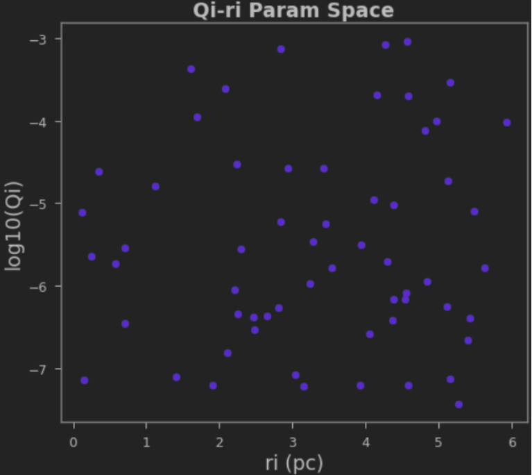
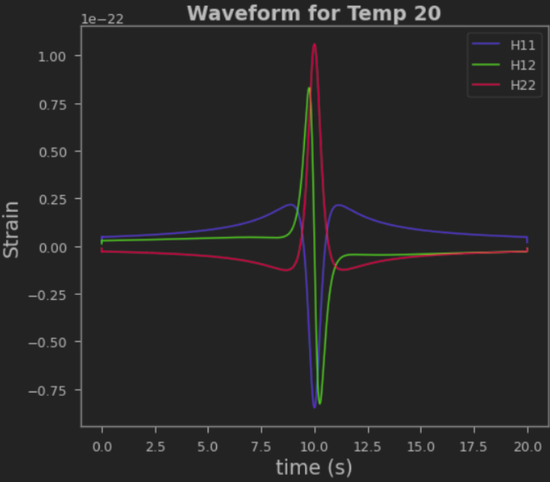
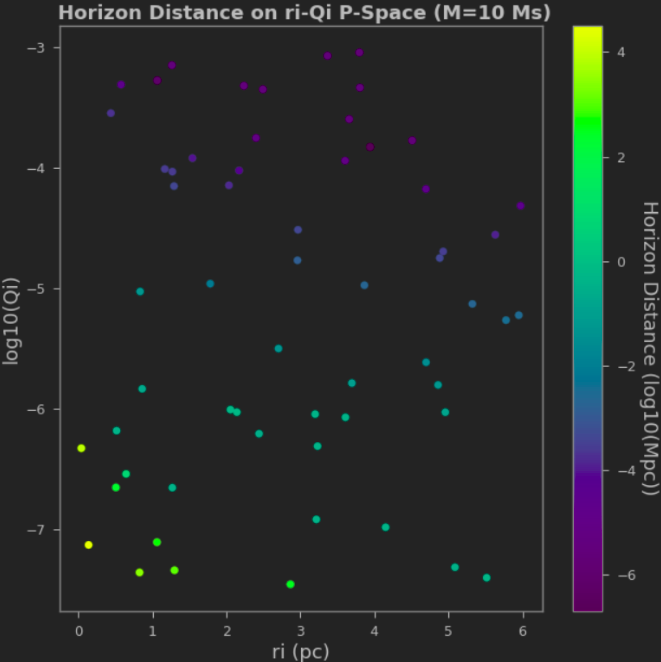
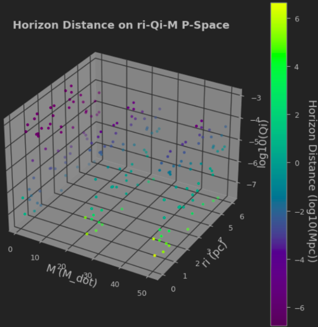
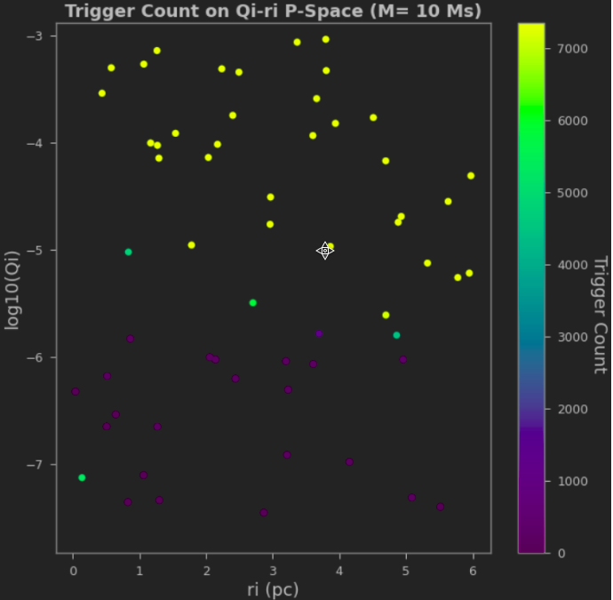
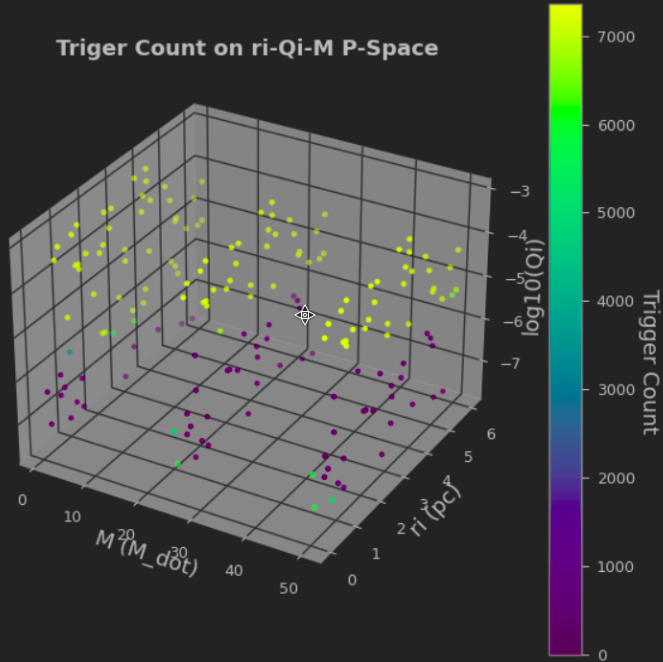
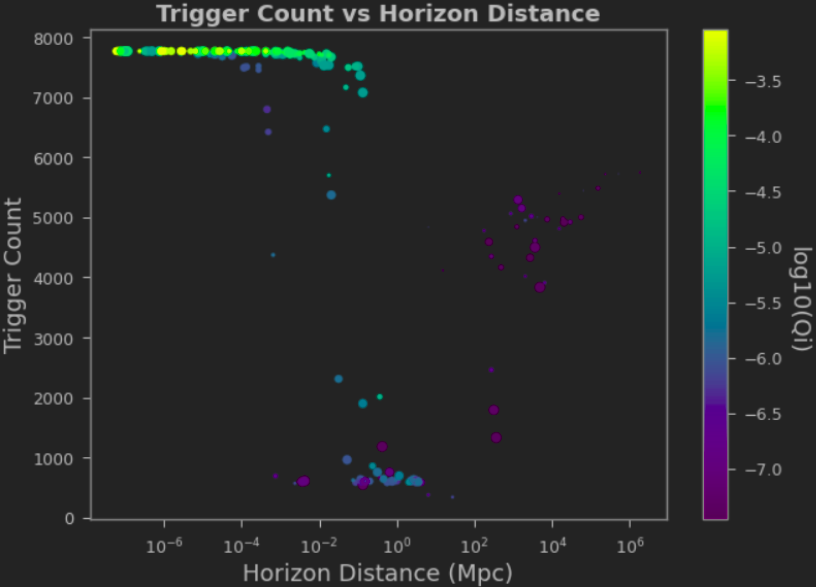

## Generate_Waveforms:
<ul>
<li>Functions: tempgen.py
    <ul>
    <li>generate() generates waveforms using a mass input and a dataframe with ri’s and Qi’s.
        R_pars.ipynb:
    <li>Generate randomized set of ri and Qi
    <li>Output: Params.csv (59 sets of ri (pc) and Qi (log10))
    </ul>
<li>Gen.py
    <ul>
    <li>Generate waveforms 
    <li>Input: Params.csv, M = [1, 10, 25, 50] (solar masses)
    <li>Output: Samples.hdf5 (59 waveforms for 4 masses, 59*4=236)
    </ul>
</ul>

<table>
    <tr>
    <td></td>
    <td></td>
    </tr>
    <tr>
    <td>Random Parameters in Params.csv</td>
    <td>Example of a waveform in Samples.hdf5</td>
    </tr>
</table>

## Horizon Distance
<ul>
<li>Functions: snrs.py: snr() calculates snr (or newsnr)
<li>Get_Horizon.ipynb:
    <ul>
    <li>Finds the horizon distance
    <li>Inputs: Samples.hdf5, H_200s.csv (200 seconds of Hanfors strain for snr())
    <li>Output: Horizon.csv
    </ul>
</ul>

<table>
    <tr>
    <td></td>
    <td></td>
    </tr>
</table>

## Trigger_Count
<ul>
<li>Functions: snrs.py: snr() calculates snr (or newsnr)
<li>SNR_Calc: (SNR.py)
    <ul>
    <li>Calculate SNR (using plus and cross pol) for all 236 templates using ~3 hr LIGO Hanford and Livingston strain
    <li>Get Triggers from the SNRs (threshold=3.5, window=1)
    <li>Input: Samples.hdf5, H.txt & L.txt (H1 and L1 ~3 hr strain file)
    <li>Output: Triggers.hdf5
    </ul>
<li>Find_Coincs_Manual.ipynb:
    <ul>
    <li>Finds H1 and L1 coincident triggers
    <li>Input: Trigger.hdf5
    <li>Output: Coinc_manual.hdf5
    </ul>
<li>Pycbc_workflow 
    <ul>
    <li>Triggers_banks_files.ipynb:
        <ul>
        <li>Generates Template bank and H1 and L1 trigger files
        <li>Input: Trigger.hdf5
        <li>Output: Tbank.hdf5 (template bank), Htrigs.hdf5 & Ltrigs.hdf5 (trigger files)
        </ul>
    <li>Run.sh  (Please save the required input files in the same directory as run.sh)
        <ul>
        <li>Uses pycbc_coinc_findtrigs.py to find coinc triggers
        <li>Inputs: Tbank.hdf5, Htrigs.hdf5, and Ltrigs.hdf5
        <li>Output: Coincs.hdf5
        </ul>
    <li>Read_Output.ipynb:
        <ul>
        <li>Convert the pycbc_coinc_findtrigs.py output into a different format
        <li>Input: Coincs.hdf5
        <li>Output: Coincs_wf.hdf5
        </ul>
    </ul>
<li>Trigger_analysis.ipynb
    <ul>
    <li>Plot outputs from Coincs_wf.hdf5
    <li>Compares workflow and manual calculations
    <li>Input: Coincs_wf.hdf5, coinc_manual.hdf5
    </ul>
</ul>

<table>
    <tr>
    <td></td>
    <td></td>
    </tr>
</table>

